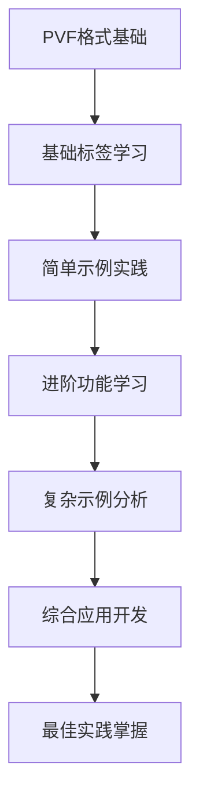

# AI学习优化指南

## 🤖 设计理念

本知识库专门为AI学习和理解进行了优化，通过结构化、标准化和语义化的设计，让AI能够更好地理解DNF文件格式和制作方法。

## 📊 AI友好的知识库特性

### 1. 层次化结构设计

```
知识库架构
├── 基础概念层 (01-基础类型)
│   ├── 简单概念 ⭐
│   ├── 基础操作 ⭐⭐
│   └── 常用功能 ⭐⭐
├── 进阶功能层 (02-高级类型)
│   ├── 复杂功能 ⭐⭐⭐
│   ├── 高级技巧 ⭐⭐⭐⭐
│   └── 专家级别 ⭐⭐⭐⭐⭐
└── 应用实践层 (05-实际示例)
    ├── 基础示例
    ├── 综合应用
    └── 最佳实践
```

### 2. 标准化数据格式

#### 标签描述格式
```markdown
## 标签名：`[tag_name]`

**功能**: 简要功能描述
**类型**: 参数类型（字符串/数值/布尔）
**必需**: 是否必需（✅必需/❌可选）
**默认值**: 默认值（如果有）
**语法**: `[tag_name] 参数值`
**示例**: `[tag_name] \`示例值\``
**注意**: 重要提醒和限制
```

#### 参数表格格式
```markdown
| 参数 | 类型 | 范围 | 默认值 | 说明 |
|------|------|------|--------|------|
| name | string | - | - | 物品名称 |
| value | int | 0-999999 | 0 | 数值大小 |
| enabled | bool | true/false | true | 是否启用 |
```

### 3. 语义化分类系统

#### 按功能分类
- **📝 配置类**: 基本属性设置
- **🎨 视觉类**: 外观和特效
- **⚡ 功能类**: 技能和机制
- **🔧 系统类**: 底层框架

#### 按复杂度分类
- **⭐ 基础**: 新手可直接使用
- **⭐⭐ 初级**: 需要基础知识
- **⭐⭐⭐ 中级**: 需要一定经验
- **⭐⭐⭐⭐ 高级**: 需要深入理解
- **⭐⭐⭐⭐⭐ 专家**: 需要丰富经验

#### 按使用频率分类
- **🔥 常用**: 日常开发必需
- **📋 一般**: 特定场景使用
- **🔍 罕见**: 特殊需求使用

## 🧠 AI学习路径设计

### 1. 渐进式学习路径



### 2. 知识点关联网络

#### 核心概念关联
- **文件格式** ↔ **标签语法** ↔ **参数类型**
- **基础标签** ↔ **组合使用** ↔ **高级功能**
- **示例代码** ↔ **实际应用** ↔ **最佳实践**

#### 依赖关系映射
```markdown
装备制作依赖链：
PVF格式规范 → 基础信息标签 → 属性标签 → 特殊效果标签 → 完整装备

物品制作依赖链：
PVF格式规范 → 基础STK类型 → 高级STK类型 → 完整物品
```

### 3. 上下文感知设计

#### 标签上下文
每个标签文档包含：
- **前置知识**: 需要先了解的概念
- **相关标签**: 经常一起使用的标签
- **后续学习**: 可以进一步学习的内容
- **实际应用**: 在哪些场景中使用

#### 示例上下文
每个示例包含：
- **适用场景**: 什么情况下使用
- **核心技术**: 使用了哪些关键标签
- **扩展方向**: 如何进一步改进
- **常见问题**: 可能遇到的问题

## 📋 AI训练数据优化

### 1. 结构化标签数据

```json
{
  "tag_name": "name",
  "function": "设置物品名称",
  "type": "string",
  "required": true,
  "syntax": "[name] `物品名称`",
  "category": "基础信息",
  "complexity": 1,
  "frequency": "high",
  "related_tags": ["icon", "description"],
  "examples": [
    "[name] `强化药水`",
    "[name] `魔法剑`"
  ]
}
```

### 2. 标准化示例格式

```markdown
### 示例：制作HP恢复药水

**目标**: 创建一个恢复500HP的药水
**难度**: ⭐⭐
**类型**: 消耗品

**核心代码**:
```pvf
#PVF_File

[name] `强效治疗药水`
[category] `consumable`
[icon] `item/consumable/potion_hp.img`
[usable job] `all`
[hp recovery] `500`
[cooltime] `1000`
```

**关键标签解析**:
- `[name]`: 设置物品显示名称
- `[hp recovery]`: 设置HP恢复量
- `[cooltime]`: 设置使用冷却时间

**扩展方向**:
- 添加特效: [effect] 标签
- 设置等级限制: [minimum level] 标签
- 添加使用音效: [sound] 标签
```

### 3. 错误模式识别

#### 常见错误分类
```markdown
格式错误:
- 使用双引号而非反引号
- 参数间使用空格而非Tab
- 行尾使用LF而非CRLF

逻辑错误:
- 参数值超出有效范围
- 必需标签缺失
- 标签组合冲突

语法错误:
- 标签名拼写错误
- 参数格式不正确
- 缺少必要的分隔符
```

## 🔍 AI查询优化

### 1. 多维度索引系统

#### 功能索引
```markdown
属性设置相关:
- [physical attack]: 物理攻击力
- [magical attack]: 魔法攻击力
- [physical defense]: 物理防御力

视觉效果相关:
- [icon]: 图标设置
- [effect]: 特效设置
- [animation]: 动画设置
```

#### 场景索引
```markdown
新手制作场景:
- 制作简单药水 → 消耗品详解
- 制作基础装备 → 装备基础信息

进阶制作场景:
- 制作套装装备 → 特殊效果标签
- 制作随机盒子 → 潘多拉魔盒详解
```

### 2. 智能推荐系统

#### 基于当前学习内容推荐
```markdown
正在学习: 基础装备制作
推荐下一步:
1. 装备属性设置 (相关度: 95%)
2. 装备图标设置 (相关度: 85%)
3. 装备特效添加 (相关度: 75%)
```

#### 基于问题类型推荐
```markdown
问题类型: 格式错误
推荐资源:
1. PVF格式规范 (匹配度: 100%)
2. 格式检查工具 (匹配度: 90%)
3. 常见问题解答 (匹配度: 80%)
```

## 🎯 AI应用场景优化

### 1. 代码生成辅助

#### 模板生成
AI可以基于用户需求自动生成基础模板：
```markdown
用户需求: "制作一个增加100攻击力的戒指"
AI生成模板:
```pvf
#PVF_File

[name] `力量戒指`
[category] `accessory`
[equipment type] `ring`
[physical attack] `100`
[icon] `item/accessory/ring_power.img`
[minimum level] `1`
```

#### 参数建议
AI可以基于上下文建议合适的参数值：
```markdown
当前设置: [minimum level] `50`
AI建议: 
- [physical attack] 建议范围: 200-300
- [price] 建议范围: 50000-100000
- [rarity] 建议设置: `uncommon` 或 `rare`
```

### 2. 错误检测和修复

#### 自动错误检测
```markdown
检测到的问题:
1. 第5行: 使用了双引号，应该使用反引号
2. 第8行: 参数间使用空格，应该使用Tab
3. 第12行: 缺少必需的 [category] 标签
```

#### 智能修复建议
```markdown
修复建议:
1. 将 [name] "物品名" 改为 [name] `物品名`
2. 将空格分隔改为Tab分隔
3. 添加 [category] `equipment` 标签
```

### 3. 学习进度跟踪

#### 知识掌握评估
```markdown
当前掌握情况:
- 基础格式: ✅ 已掌握
- 基础标签: ✅ 已掌握  
- 属性设置: 🔄 学习中
- 特殊效果: ❌ 未开始
```

#### 个性化学习路径
```markdown
推荐学习路径:
1. 完成属性设置练习 (预计30分钟)
2. 学习视觉效果标签 (预计45分钟)
3. 实践综合示例制作 (预计60分钟)
```

---

*通过这些AI优化设计，知识库将成为AI学习和辅助开发的强大工具*