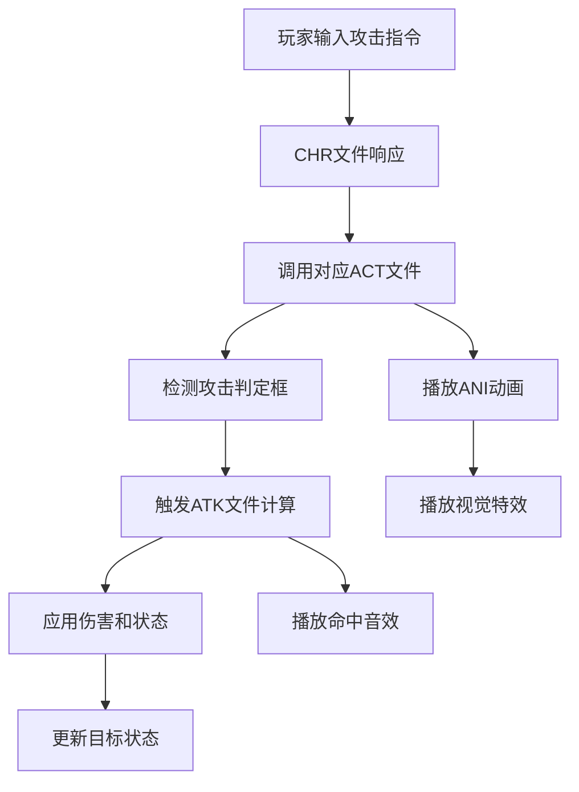

# ATK文件依赖关系简介

## 🔗 依赖关系概述

ATK文件作为攻击属性定义文件，在DNF文件系统中扮演着核心角色。它不是独立存在的，而是与多种文件类型形成复杂的依赖关系网络，共同实现完整的攻击系统。

## 📁 核心依赖文件类型

### 1. CHR文件（角色文件）- 主要引用者

**依赖关系**: CHR文件引用ATK文件
**关联方式**: 通过攻击信息标签引用
**功能**: 为角色的攻击动作提供伤害属性

**引用示例**:
```
// CHR文件中的攻击信息引用
[attack info] attack1 `Attack1.atk`
[attack info] attack2 `Attack2.atk`
[attack info] attack3 `Attack3.atk`
```

**依赖说明**:
- CHR文件定义角色的基础属性和动作
- ATK文件提供具体的攻击伤害计算
- 两者配合实现完整的角色攻击系统

---

### 2. ACT文件（动作文件）- 时机控制

**依赖关系**: ACT文件控制ATK文件的触发时机
**关联方式**: 通过攻击框和时间轴配合
**功能**: 定义攻击判定的精确时机

**配合机制**:
```
// ACT文件定义攻击时机
[ATTACK BOX]
-50 -100 -50    // 攻击判定框
50 0 50

// ATK文件定义攻击效果
[damage] 100
[attack type] [physic]
```

**协作流程**:
1. ACT文件定义动作播放和攻击框出现时机
2. 攻击框触发时调用对应的ATK文件
3. ATK文件计算伤害和状态效果
4. 返回结果给游戏引擎处理

---

### 3. ANI文件（动画文件）- 视觉效果

**依赖关系**: ANI文件与ATK文件配合实现攻击表现
**关联方式**: 通过帧数据和特效系统
**功能**: 提供攻击的视觉和音效反馈

**配合示例**:
```
// ANI文件中的攻击帧
[FRAME005]
[IMAGE] `character/knight/attack.img` 0
[ATTACK BOX] -50 -100 -50 50 0 50
[DELAY] 100

// 对应的ATK文件
[damage] 150
[hit wav] `SWORD_HIT`
[hit info] [cut] [blood] 50 1.0
```

**协作关系**:
- ANI文件控制攻击动画的播放
- ATK文件定义攻击的数值效果
- 音效和视觉效果由两者共同决定

---

### 4. OBJ文件（被动对象）- 特殊应用

**依赖关系**: OBJ文件可以引用ATK文件定义攻击属性
**关联方式**: 通过攻击信息标签
**功能**: 为陷阱、召唤物等被动对象提供攻击能力

**引用示例**:
```
// OBJ文件中引用ATK
[attack info] `trap_damage.atk`

// 对应的ATK文件内容
[damage] 200
[attack type] [magic]
[elemental property] [fire element]
[active status] [burn] 100 10 5000 50
```

**应用场景**:
- 陷阱类技能的伤害定义
- 召唤物的攻击属性
- 环境伤害效果

---

### 5. SKL文件（技能文件）- 技能系统

**依赖关系**: 技能文件间接使用ATK文件
**关联方式**: 通过技能等级和伤害公式
**功能**: 为技能提供等级化的伤害计算

**关联机制**:
```
// 技能文件定义伤害公式
[level info]
    [damage] 100 120 140 160 180  // 各等级基础伤害

// ATK文件应用技能伤害
[damage] %d                       // 由技能系统传入
[damage bonus] 20                 // 额外加成
```

---

## 🎯 文件间协作流程

### 完整攻击流程



### 数据流向分析

1. **输入阶段**: 玩家操作 → CHR文件识别
2. **动作阶段**: CHR → ACT → ANI (动作和动画)
3. **判定阶段**: ACT攻击框 → 碰撞检测
4. **计算阶段**: ATK文件 → 伤害计算 → 状态应用
5. **反馈阶段**: 视觉效果 + 音效 + 数值显示

---

## 🔧 依赖文件配置要点

### CHR文件配置

**攻击信息引用**:
```
[attack info] attack1 `swordman/basic_attack1.atk`
[attack info] attack2 `swordman/basic_attack2.atk`
[attack info] combo1  `swordman/combo_finish.atk`
```

**武器音效配置**:
```
[weapon sound] attack1 `sword_swing1.wav`
[weapon hit sound] attack1 `sword_hit1.wav`
```

**关键要点**:
- 攻击信息标签必须与动作名称对应
- 文件路径要正确，使用相对路径
- 音效文件要与ATK文件的[hit wav]配合

---

### ACT文件配置

**攻击框设置**:
```
[ATTACK BOX]
-50 -100 -50    // 左下后坐标
50 0 50         // 右上前坐标
```

**时机控制**:
```
[FRAME 8]       // 第8帧开始攻击判定
[ATTACK BOX] -50 -100 -50 50 0 50
[DELAY] 50      // 持续50毫秒

[FRAME 9]       // 第9帧结束攻击判定
[DELAY] 100
```

**关键要点**:
- 攻击框大小要合理，不能过大或过小
- 攻击时机要与动画同步
- 多段攻击需要设置多个攻击框

---

### ANI文件配置

**攻击帧设置**:
```
[FRAME005]
[IMAGE] `character/swordman/attack.img` 0
[ATTACK BOX] -50 -100 -50 50 0 50
[DELAY] 80
[PLAY SOUND] `sword_swing.wav`
```

**特效配置**:
```
[GRAPHIC EFFECT]
`effect/sword_trail.ptl`    // 剑气特效
0 0                         // 特效位置偏移
```

**关键要点**:
- 攻击框要与ACT文件保持一致
- 音效播放时机要准确
- 特效位置要与攻击判定匹配

---

## ⚠️ 常见依赖问题

### 文件路径错误

**问题表现**: 攻击无效果，控制台报错
**原因分析**: ATK文件路径不正确
**解决方案**:
```
// 错误示例
[attack info] attack1 `wrong_path/attack.atk`

// 正确示例
[attack info] attack1 `character/swordman/attack1.atk`
```

---

### 攻击框不匹配

**问题表现**: 攻击判定异常，命中范围错误
**原因分析**: ACT和ANI文件中的攻击框设置不一致
**解决方案**: 确保两个文件中的攻击框参数完全相同

---

### 音效播放异常

**问题表现**: 攻击无声音或音效错误
**原因分析**: ATK文件中的[hit wav]与实际音效文件不匹配
**解决方案**:
```
// 检查ATK文件
[hit wav] `SWORD_HIT`

// 检查音效资源是否存在
// 确保音效标识符正确
```

---

### 状态效果无效

**问题表现**: 异常状态不生效
**原因分析**: 状态参数设置错误或目标免疫
**解决方案**:
```
// 检查状态设置
[active status] [poison] 100 10 5000 100
// 确保概率、等级、持续时间、伤害都设置正确

// 检查目标是否有状态免疫
```

---

## 🎯 最佳实践建议

### 文件组织结构

```
character/swordman/
├── swordman.chr           # 角色主文件
├── action/
│   ├── attack1.act        # 攻击动作1
│   ├── attack2.act        # 攻击动作2
│   └── combo.act          # 连击动作
├── animation/
│   ├── attack1.ani        # 攻击动画1
│   ├── attack2.ani        # 攻击动画2
│   └── combo.ani          # 连击动画
└── attackinfo/
    ├── attack1.atk        # 攻击属性1
    ├── attack2.atk        # 攻击属性2
    └── combo.atk          # 连击属性
```

### 命名规范

**文件命名**:
- 使用描述性名称: `basic_attack1.atk` 而不是 `atk1.atk`
- 保持一致性: 相关文件使用相同前缀
- 避免特殊字符: 只使用字母、数字、下划线

**标签引用**:
- 使用相对路径: `character/swordman/attack1.atk`
- 路径分隔符统一使用正斜杠 `/`
- 确保大小写正确

### 版本兼容性

**向后兼容**:
- 新增标签时保持旧标签功能
- 参数扩展时提供默认值
- 测试不同版本的兼容性

**文档维护**:
- 记录文件间的依赖关系
- 更新时同步修改相关文件
- 建立版本控制和备份机制

---

## 🔍 调试技巧

### 依赖关系检查

1. **文件存在性**: 确认所有引用的ATK文件都存在
2. **路径正确性**: 验证文件路径的准确性
3. **语法正确性**: 检查ATK文件的语法格式
4. **参数合理性**: 验证数值参数的合理范围

### 测试方法

1. **单独测试**: 先测试单个ATK文件的效果
2. **组合测试**: 再测试与其他文件的配合效果
3. **边界测试**: 测试极值参数的表现
4. **兼容测试**: 测试不同版本的兼容性

### 问题定位

1. **日志分析**: 查看游戏日志中的错误信息
2. **分步调试**: 逐步注释代码定位问题
3. **对比测试**: 与正常工作的文件对比
4. **工具辅助**: 使用PVF编辑工具检查语法

---

*理解ATK文件的依赖关系是掌握DNF文件系统的关键，正确配置这些依赖关系能确保攻击系统的稳定运行*