# DNF引擎中Squirrel脚本调用机制详解

## 📖 目录
- [引言](#引言)
- [Squirrel语言基础](#squirrel语言基础)
- [DNF引擎脚本架构](#dnf引擎脚本架构)
- [脚本加载机制](#脚本加载机制)
- [双轨触发机制](#双轨触发机制)
- [函数签名驱动机制](#函数签名驱动机制)
- [状态注册驱动机制](#状态注册驱动机制)
- [脚本执行流程](#脚本执行流程)
- [性能优化策略](#性能优化策略)
- [调试与排错](#调试与排错)
- [最佳实践](#最佳实践)

---

## 引言

DNF（地下城与勇士）游戏引擎采用Squirrel脚本语言作为其核心脚本系统，用于实现技能逻辑、角色行为、游戏机制等功能。本文档深入解析DNF引擎中Squirrel脚本的调用机制，帮助开发者理解脚本系统的工作原理。

### 为什么选择Squirrel？

1. **轻量级**: 相比Lua等脚本语言，Squirrel更加轻量
2. **C++友好**: 与C++引擎集成度高，调用效率优秀
3. **语法简洁**: 类似JavaScript的语法，学习成本低
4. **内存安全**: 自动垃圾回收，减少内存泄漏风险

---

## Squirrel语言基础

### 语言特性

#### 1. 动态类型系统
```squirrel
// 变量无需声明类型
local name = "DNF";           // 字符串
local level = 70;             // 整数
local rate = 1.5;             // 浮点数
local isActive = true;        // 布尔值
```

#### 2. 表（Table）数据结构
```squirrel
// 表是Squirrel的核心数据结构
local player = {
    name = "战士",
    level = 70,
    hp = 1000,
    skills = ["剑气", "拔刀斩", "鬼剑术"]
};

// 访问表成员
print(player.name);           // 输出: 战士
print(player["level"]);       // 输出: 70
```

#### 3. 函数定义
```squirrel
// 普通函数
function calculateDamage(attack, defense)
{
    return attack - defense;
}

// 匿名函数
local multiply = function(a, b) { return a * b; };

// 表中的方法
local skill = {
    name = "火球术",
    cast = function(target) {
        print("对 " + target + " 释放 " + this.name);
    }
};
```

#### 4. 类和继承
```squirrel
// 类定义
class Character
{
    constructor(name, level)
    {
        this.name = name;
        this.level = level;
    }
    
    function attack(target)
    {
        print(this.name + " 攻击 " + target);
    }
}

// 继承
class Warrior extends Character
{
    constructor(name, level, weapon)
    {
        base.constructor(name, level);
        this.weapon = weapon;
    }
    
    function slash(target)
    {
        print(this.name + " 用 " + this.weapon + " 斩击 " + target);
    }
}
```

### DNF中的Squirrel扩展

#### 1. 全局对象扩展
```squirrel
// DNF引擎提供的全局对象
IRDSQRCharacter    // 角色管理对象
sq_RGB()           // 颜色函数
sq_flashScreen()   // 屏幕闪烁函数
```

#### 2. 对象方法扩展
```squirrel
// obj对象的扩展方法（由引擎提供）
obj.sq_GetState()              // 获取状态
obj.sq_SetCurrentAnimation()   // 设置动画
obj.sq_AddSetStatePacket()     // 添加状态包
```

---

## DNF引擎脚本架构

### 整体架构图

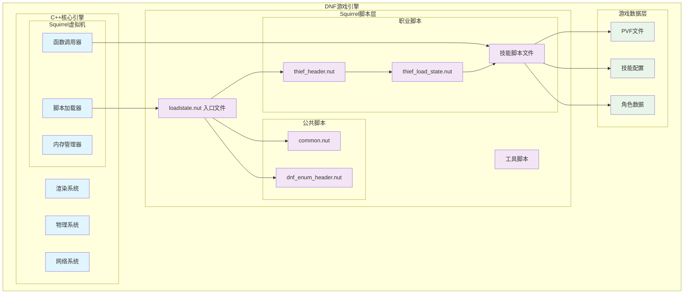

### 脚本依赖关系图

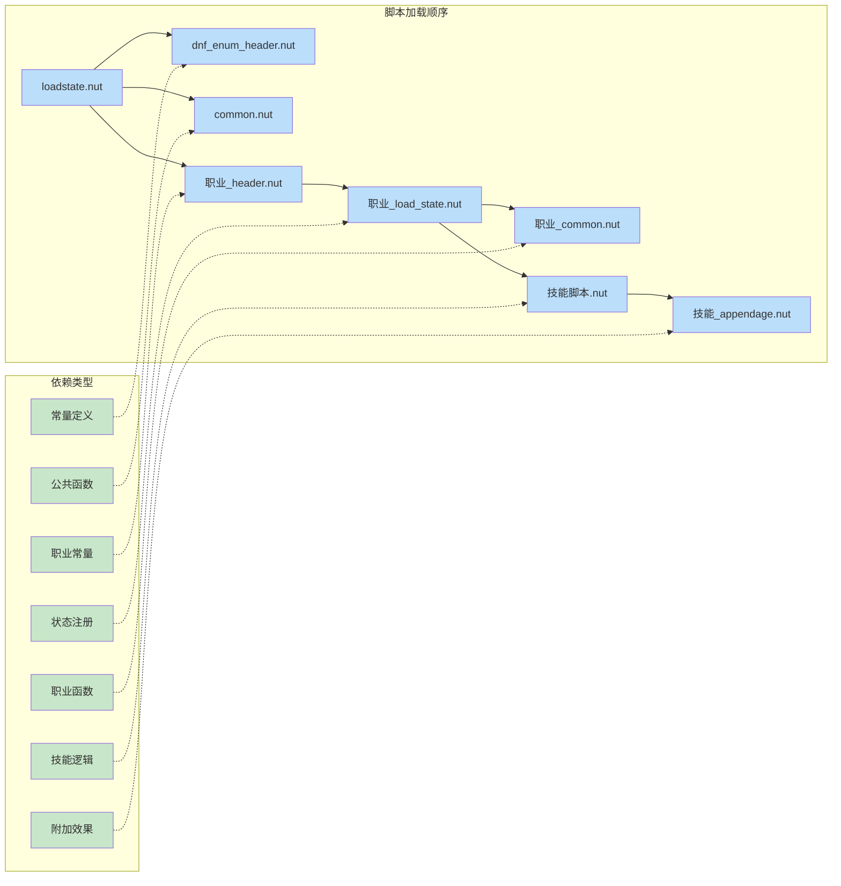

### 脚本文件层次结构

#### 1. 核心层（Core Layer）
- **loadstate.nut**: 脚本系统入口点
- **common.nut**: 公共函数库
- **dnf_enum_header.nut**: 枚举常量定义

#### 2. 职业层（Class Layer）
- **[职业]_header.nut**: 职业专用常量定义
- **[职业]_load_state.nut**: 职业状态加载器
- **[职业]_common.nut**: 职业公共函数

#### 3. 技能层（Skill Layer）
- **[技能名].nut**: 具体技能实现
- **[技能名]_appendage.nut**: 技能附加效果

---

## 脚本加载机制

### 加载时机与顺序

#### 1. 游戏启动时加载流程图

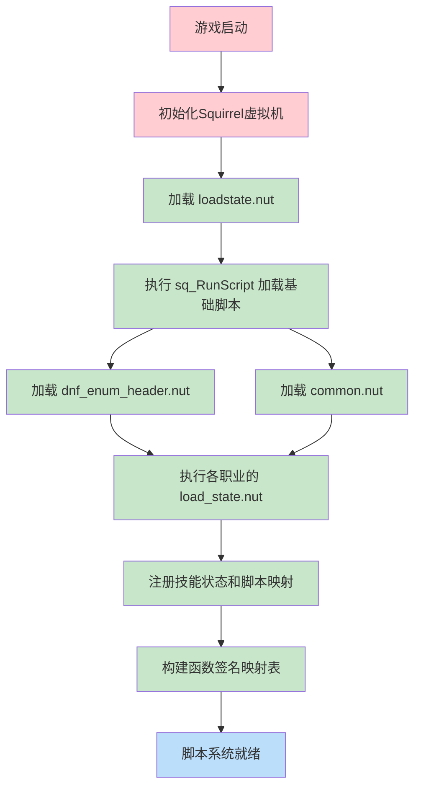

#### 2. 运行时动态加载流程图

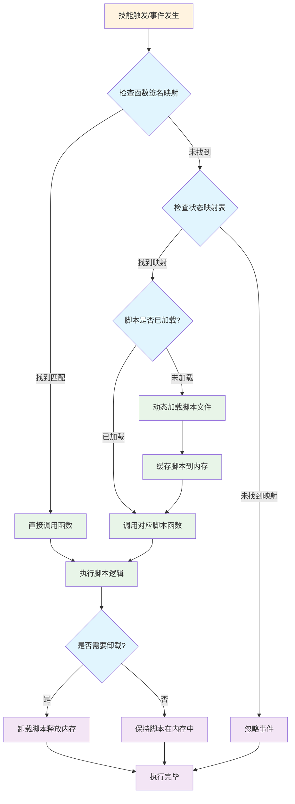

### 加载函数对比分析

#### sq_RunScript() - 封包内脚本加载
```squirrel
// 语法
sq_RunScript("相对路径/脚本文件.nut");

// 示例
sq_RunScript("sqr/dnf_enum_header.nut");
sq_RunScript("sqr/character/thief/thief_header.nut");
```

**特点**:
- 从游戏封包（PVF）内加载
- 路径基于封包根目录的相对路径
- 加载速度快（内存读取）
- 修改后需重新打包才能生效

#### dofile() - 文件系统脚本加载
```squirrel
// 语法
dofile("绝对路径或相对路径");

// 示例
dofile("D:/DNF/scripts/test.nut");
dofile("./scripts/debug.nut");
```

**特点**:
- 从文件系统直接加载
- 支持绝对路径和相对路径
- 修改后立即生效（便于调试）
- 依赖磁盘I/O，速度相对较慢

### 加载策略选择

#### 开发阶段策略
```squirrel
// 开发时使用dofile便于调试
if (DEBUG_MODE) {
    dofile("D:/DNF_Dev/scripts/skill_test.nut");
} else {
    sq_RunScript("sqr/character/thief/skill_test.nut");
}
```

#### 生产环境策略
```squirrel
// 生产环境统一使用sq_RunScript
sq_RunScript("sqr/loadstate.nut");
```

---

## 双轨触发机制

DNF引擎采用独特的"双轨触发机制"来调用Squirrel脚本，这种设计兼顾了性能和灵活性。

### 机制概述图

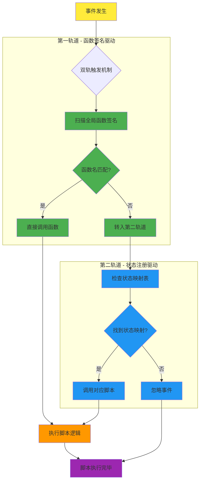

### 双轨机制性能对比图

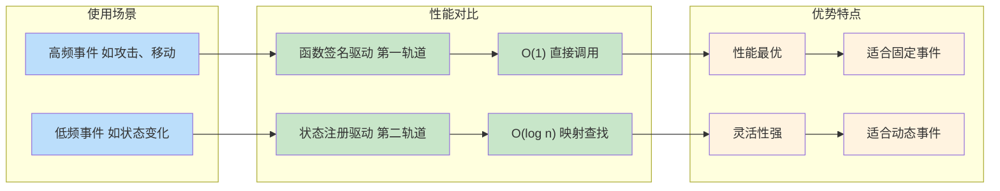

### 双轨机制的优势

1. **性能优化**: 第一轨道避免了状态查找的开销
2. **灵活性**: 第二轨道支持动态状态管理
3. **兼容性**: 两种机制可以并存，互不冲突
4. **扩展性**: 便于添加新的触发方式

---

## 函数签名驱动机制

### 工作原理

函数签名驱动机制是DNF引擎的主要脚本调用方式，通过预定义的函数名模式来自动识别和调用脚本函数。

#### 1. 函数签名模式

```squirrel
// 基本模式：事件名_职业名
function 事件名_职业名(参数列表)
{
    // 函数实现
}

// 具体示例
function useSkill_after_ATGunner(obj, skillIndex, isSuccess)
{
    // 女枪手技能使用后的处理
}

function onDamage_Swordman(obj, damager, damage)
{
    // 剑魂受伤时的处理
}
```

#### 2. 职业标识符对照表

| 职业中文名 | 职业标识符 | 示例函数 |
|---------|----------|----------|
| 鬼剑士 | Swordman | `useSkill_Swordman` |
| 格斗家 | Fighter | `onDamage_Fighter` |
| 神枪手 | Gunner | `onAttack_Gunner` |
| 魔法师 | Mage | `onStateChange_Mage` |
| 圣职者 | Priest | `onLevelUp_Priest` |
| 暗夜使者 | Thief | `onSkillCast_Thief` |
| 女枪手 | ATGunner | `useSkill_after_ATGunner` |

#### 3. 事件类型分类

**技能相关事件**:
```squirrel
function useSkill_before_职业名(obj, skillIndex)     // 技能使用前
function useSkill_after_职业名(obj, skillIndex)      // 技能使用后
function onSkillCast_职业名(obj, skillIndex)         // 技能施放时
function onSkillEnd_职业名(obj, skillIndex)          // 技能结束时
```

**战斗相关事件**:
```squirrel
function onAttack_职业名(obj, target, damage)        // 攻击时
function onDamage_职业名(obj, attacker, damage)      // 受伤时
function onKill_职业名(obj, target)                  // 击杀时
function onDeath_职业名(obj, killer)                 // 死亡时
```

**状态相关事件**:
```squirrel
function onStateStart_职业名(obj, state)             // 状态开始
function onStateEnd_职业名(obj, state)               // 状态结束
function onStateChange_职业名(obj, oldState, newState) // 状态改变
```

**全局事件（无职业限制）**:
```squirrel
function onGameStart()                               // 游戏开始
function onLevelLoad(mapName)                        // 关卡加载
function onPlayerJoin(playerObj)                     // 玩家加入
function onPlayerLeave(playerObj)                    // 玩家离开
```

### 函数签名扫描机制

#### 1. 扫描时机流程图

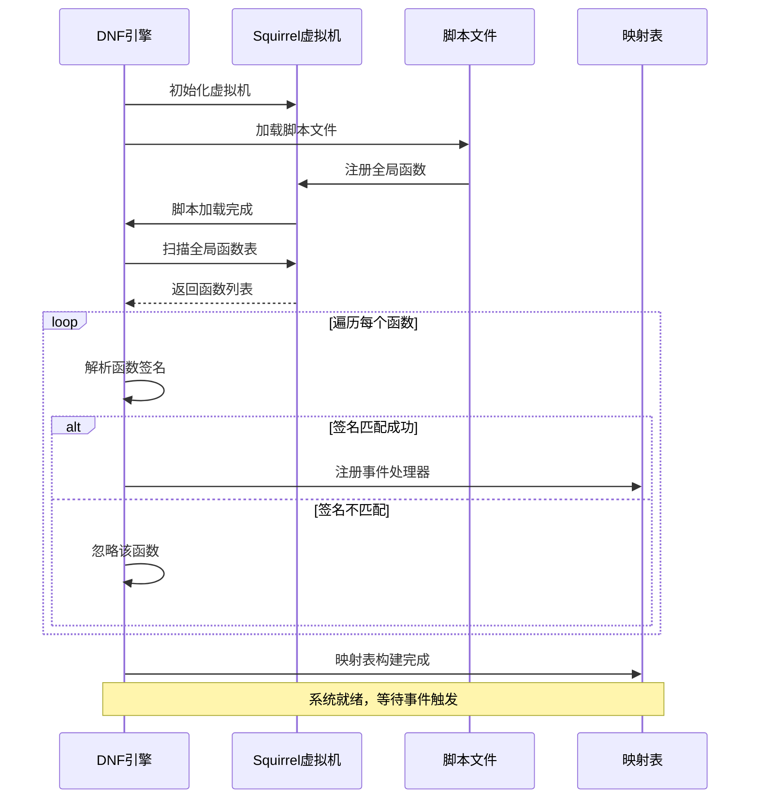

#### 2. 签名解析算法流程图

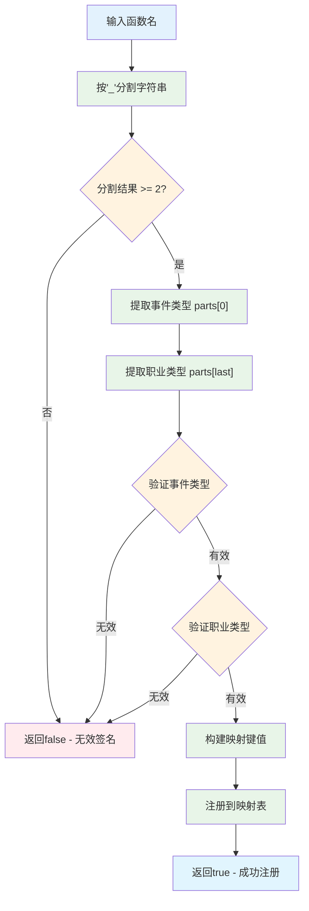

#### 3. 事件-函数映射表结构图

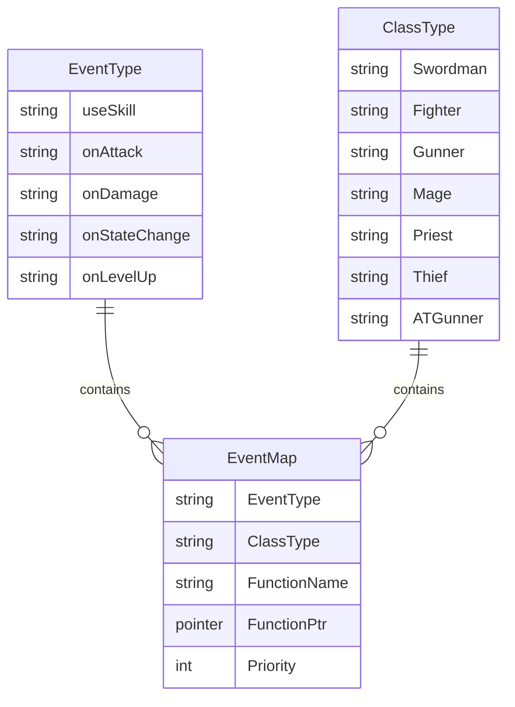

#### 4. 签名解析算法代码

```cpp
// 伪代码：引擎内部的签名解析逻辑
bool ParseFunctionSignature(string functionName)
{
    // 分割函数名
    vector<string> parts = split(functionName, "_");
    
    if (parts.size() < 2) return false;
    
    string eventType = parts[0];
    string classType = parts[parts.size() - 1];
    
    // 验证事件类型
    if (!IsValidEventType(eventType)) return false;
    
    // 验证职业类型
    if (!IsValidClassType(classType)) return false;
    
    // 注册到映射表
    RegisterEventHandler(eventType, classType, functionName);
    
    return true;
}
```

#### 3. 调用优先级
当多个函数匹配同一事件时，调用优先级如下：
1. **具体职业函数** > **通用函数**
2. **后加载的函数** > **先加载的函数**
3. **用户脚本** > **系统脚本**

### 实际应用示例

#### 示例1：技能使用监听
```squirrel
// 监听所有剑魂的技能使用
function useSkill_after_Swordman(obj, skillIndex, isSuccess)
{
    if (!obj || !isSuccess) return;
    
    // 获取技能信息
    local skillName = obj.sq_GetSkillName(skillIndex);
    local skillLevel = obj.sq_GetSkillLevel(skillIndex);
    
    // 记录技能使用
    print("剑魂使用了技能: " + skillName + " (等级: " + skillLevel + ")");
    
    // 特殊技能处理
    switch(skillIndex)
    {
        case SKILL_WAVE_SWORD:
            // 波动剑特殊处理
            obj.sq_AddBuff(BUFF_SWORD_MASTERY, 5000);
            break;
        case SKILL_GHOST_SLASH:
            // 鬼斩特殊处理
            obj.sq_PlayEffect("ghost_slash_effect.ani");
            break;
    }
}
```

#### 示例2：全局伤害监听
```squirrel
// 监听所有角色的受伤事件
function onDamage(obj, attacker, damage, damageType)
{
    if (!obj || !attacker) return;
    
    // 记录伤害信息
    local targetName = obj.sq_GetName();
    local attackerName = attacker.sq_GetName();
    
    print(attackerName + " 对 " + targetName + " 造成了 " + damage + " 点伤害");
    
    // 暴击判定
    if (damageType == DAMAGE_TYPE_CRITICAL) {
        // 播放暴击特效
        obj.sq_PlayEffect("critical_hit.ani");
        obj.sq_SetShake(obj, 3, 200);
    }
    
    // 低血量警告
    if (obj.sq_GetHPRate() < 0.2) {
        obj.sq_PlaySound("low_hp_warning.wav");
    }
}
```

---

## 状态注册驱动机制

### 工作原理

状态注册驱动机制通过显式注册状态与脚本的映射关系，实现精确的状态控制和脚本调用。

### 状态注册流程图

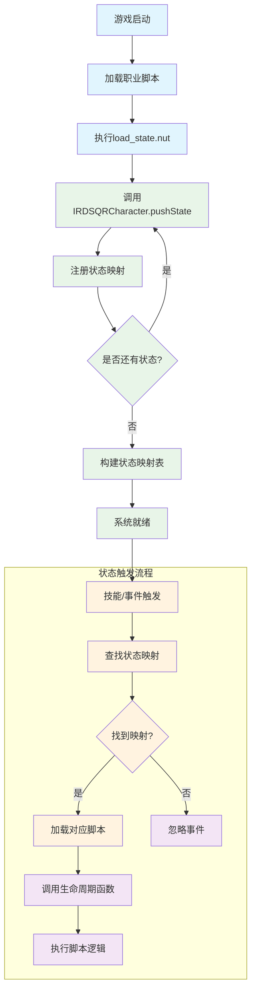

### 状态生命周期图

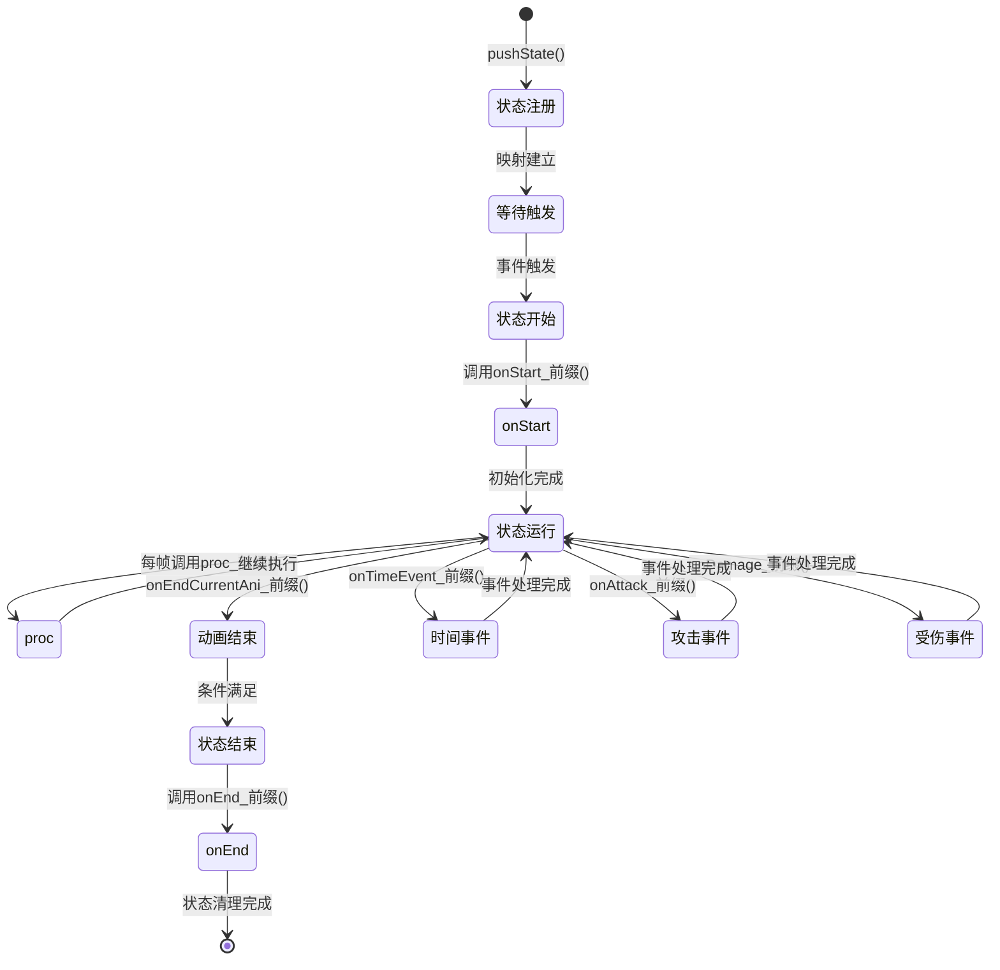

#### 1. 注册函数详解

```squirrel
IRDSQRCharacter.pushState(
    职业枚举,           // ENUM_CHARACTERJOB_XXX
    "脚本文件路径",      // 相对于sqr目录的路径
    "函数前缀",         // 函数名前缀
    状态编号,           // 唯一的状态ID
    技能编号            // 对应的技能ID（可选，-1表示无关联）
);
```

#### 2. 参数详细说明

**职业枚举**:
```squirrel
ENUM_CHARACTERJOB_SWORDMAN     // 鬼剑士
ENUM_CHARACTERJOB_FIGHTER      // 格斗家
ENUM_CHARACTERJOB_GUNNER       // 神枪手
ENUM_CHARACTERJOB_MAGE         // 魔法师
ENUM_CHARACTERJOB_PRIEST       // 圣职者
ENUM_CHARACTERJOB_THIEF        // 暗夜使者
ENUM_CHARACTERJOB_ATGUNNER     // 女枪手
```

**脚本文件路径**:
```squirrel
// 路径规范
"Character/职业名/技能名/脚本文件.nut"

// 示例
"Character/Thief/Zskill00/Zskill00.nut"
"Character/Swordman/WaveSword/WaveSword.nut"
```

**函数前缀**:
```squirrel
// 前缀命名规范
"技能名"              // 简单命名
"职业名_技能名"        // 带职业前缀
"技能名_v2"           // 版本标识
```

#### 3. 自动调用函数模式

注册状态后，引擎会自动查找并调用以下模式的函数：

```squirrel
// 基本生命周期函数
function onStart_前缀(obj, state, datas, isResetTimer)    // 状态开始
function proc_前缀(obj)                                   // 状态持续（每帧）
function onEnd_前缀(obj)                                  // 状态结束
function onAfterSetState_前缀(obj, state, datas)         // 状态设置后

// 扩展事件函数
function onTimeEvent_前缀(obj, timeEventIndex, timeEventCount)  // 时间事件
function onAttack_前缀(obj, damager, boundingBox, isStuck)      // 攻击事件
function onDamage_前缀(obj, attacker, damage)                   // 受伤事件
function onEndCurrentAni_前缀(obj)                              // 动画结束
```

### 注册示例详解

#### 示例1：基础技能注册
```squirrel
// 在thief_load_state.nut中注册
IRDSQRCharacter.pushState(
    ENUM_CHARACTERJOB_THIEF,                    // 暗夜使者职业
    "Character/Thief/Zskill00/Zskill00.nut",   // 脚本路径
    "Zskill00",                                 // 函数前缀
    STATE_ZSKILL00,                             // 状态编号：95
    SKILL_ZSKILL00                              // 技能编号：220
);

// 对应的脚本函数（在Zskill00.nut中）
function onStart_Zskill00(obj, state, datas, isResetTimer)
{
    if (!obj) return;
    
    // 技能开始逻辑
    obj.sq_StopMove();
    obj.sq_SetCurrentAnimation(CUSTOM_ANI_01);
    obj.sq_SetCurrentAttackInfo(CUSTOM_ATK_01);
}

function proc_Zskill00(obj)
{
    if (!obj) return;
    
    // 每帧执行的逻辑
    // 例如：检查输入、更新位置等
}

function onEnd_Zskill00(obj)
{
    if (!obj) return;
    
    // 技能结束清理
    obj.sq_AddSetStatePacket(STATE_STAND, STATE_PRIORITY_USER, false);
}
```

#### 示例2：复杂技能注册
```squirrel
// 注册多阶段技能
IRDSQRCharacter.pushState(
    ENUM_CHARACTERJOB_SWORDMAN,
    "Character/Swordman/ComboSlash/ComboSlash.nut",
    "ComboSlash",
    STATE_COMBO_SLASH,
    SKILL_COMBO_SLASH
);

// 对应的脚本实现
function onStart_ComboSlash(obj, state, datas, isResetTimer)
{
    if (!obj) return;
    
    // 初始化连击计数
    obj.sq_SetStaticInt(ENUM_STATIC_INT_01, 0);
    
    // 设置第一段动画
    obj.sq_SetCurrentAnimation(CUSTOM_ANI_COMBO_01);
    obj.sq_SetCurrentAttackInfo(CUSTOM_ATK_COMBO_01);
}

function onTimeEvent_ComboSlash(obj, timeEventIndex, timeEventCount)
{
    if (!obj) return;
    
    local comboCount = obj.sq_GetStaticInt(ENUM_STATIC_INT_01);
    
    switch(timeEventIndex)
    {
        case 0:  // 第一段结束
            comboCount++;
            obj.sq_SetStaticInt(ENUM_STATIC_INT_01, comboCount);
            
            if (comboCount < 3) {
                // 继续下一段
                obj.sq_SetCurrentAnimation(CUSTOM_ANI_COMBO_02);
                obj.sq_SetCurrentAttackInfo(CUSTOM_ATK_COMBO_02);
            }
            break;
            
        case 1:  // 第二段结束
            comboCount++;
            obj.sq_SetStaticInt(ENUM_STATIC_INT_01, comboCount);
            
            // 最终段
            obj.sq_SetCurrentAnimation(CUSTOM_ANI_COMBO_03);
            obj.sq_SetCurrentAttackInfo(CUSTOM_ATK_COMBO_03);
            break;
    }
}

function onAttack_ComboSlash(obj, damager, boundingBox, isStuck)
{
    if (!obj || !damager) return;
    
    local comboCount = obj.sq_GetStaticInt(ENUM_STATIC_INT_01);
    
    // 根据连击段数应用不同效果
    switch(comboCount)
    {
        case 1:
            // 第一段：普通攻击
            break;
        case 2:
            // 第二段：增加击退
            damager.sq_AddForce(200, 0);
            break;
        case 3:
            // 第三段：暴击伤害
            local extraDamage = obj.sq_GetSTR() * 2.0;
            damager.sq_AddDamage(extraDamage);
            break;
    }
}
```

### 状态映射表管理

#### 1. 内部映射表结构
```cpp
// 伪代码：引擎内部的状态映射表
struct StateMapping
{
    int characterJob;        // 职业ID
    string scriptPath;       // 脚本路径
    string functionPrefix;   // 函数前缀
    int stateID;            // 状态ID
    int skillID;            // 技能ID
    bool isLoaded;          // 是否已加载
    ScriptObject* script;   // 脚本对象指针
};

map<int, StateMapping> g_stateMappings;  // 全局状态映射表
```

#### 2. 状态查找算法
```cpp
// 伪代码：状态查找和脚本调用
bool CallStateScript(int characterJob, int stateID, string functionName, params...)
{
    // 构造查找键
    int key = (characterJob << 16) | stateID;
    
    // 查找映射
    auto it = g_stateMappings.find(key);
    if (it == g_stateMappings.end()) {
        return false;  // 未找到映射
    }
    
    StateMapping& mapping = it->second;
    
    // 延迟加载脚本
    if (!mapping.isLoaded) {
        mapping.script = LoadScript(mapping.scriptPath);
        mapping.isLoaded = true;
    }
    
    // 构造完整函数名
    string fullFunctionName = functionName + "_" + mapping.functionPrefix;
    
    // 调用脚本函数
    return mapping.script->CallFunction(fullFunctionName, params...);
}
```

---

## 脚本执行流程

### 完整执行时序图

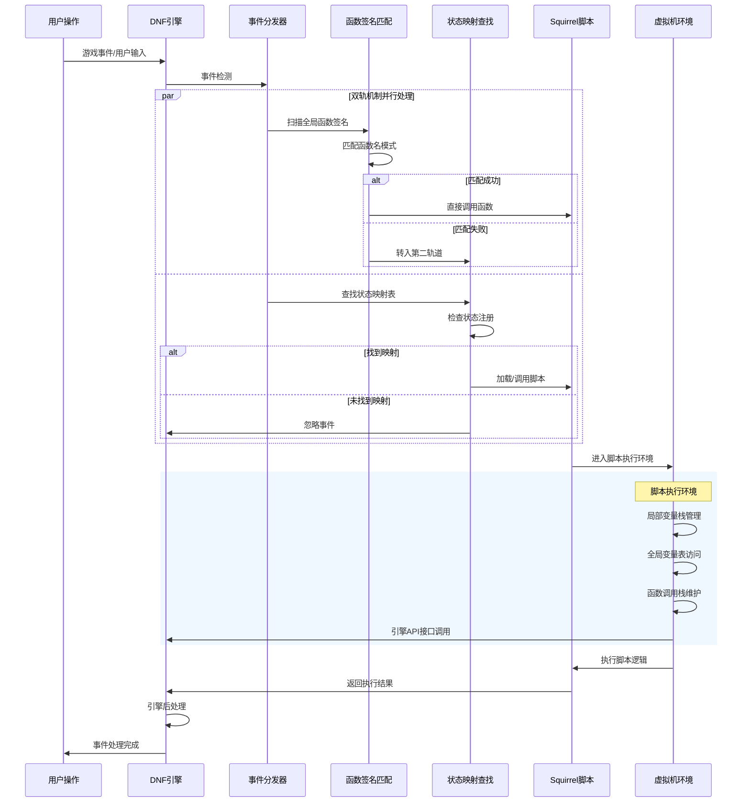

### 脚本执行环境架构图

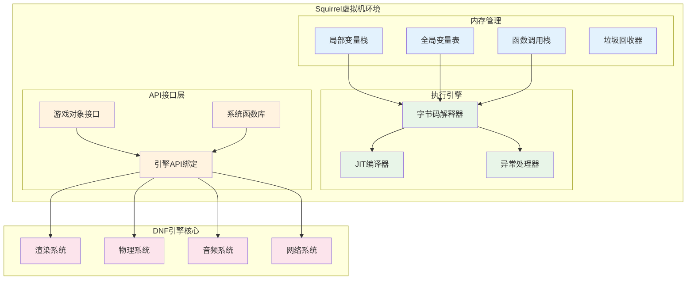

### 技能释放完整流程

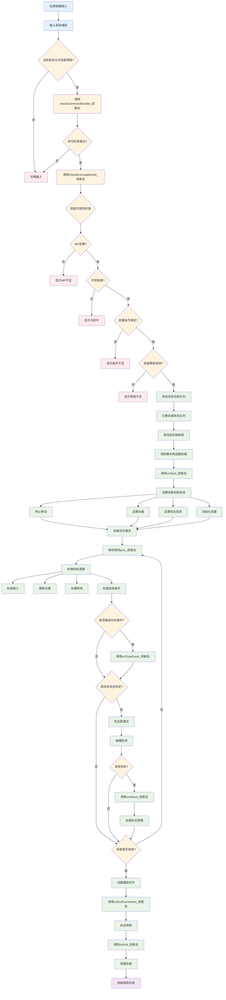

### 错误处理流程

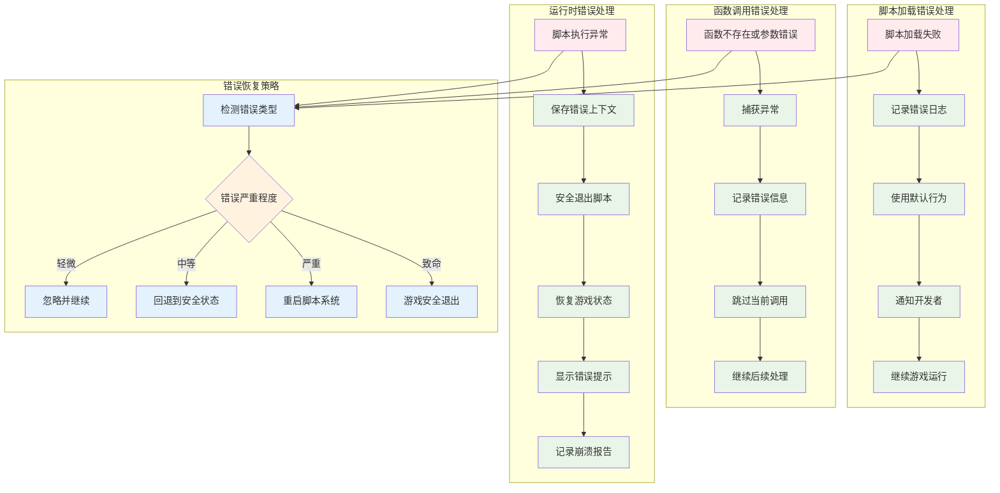

---

## 性能优化策略

### 脚本加载优化

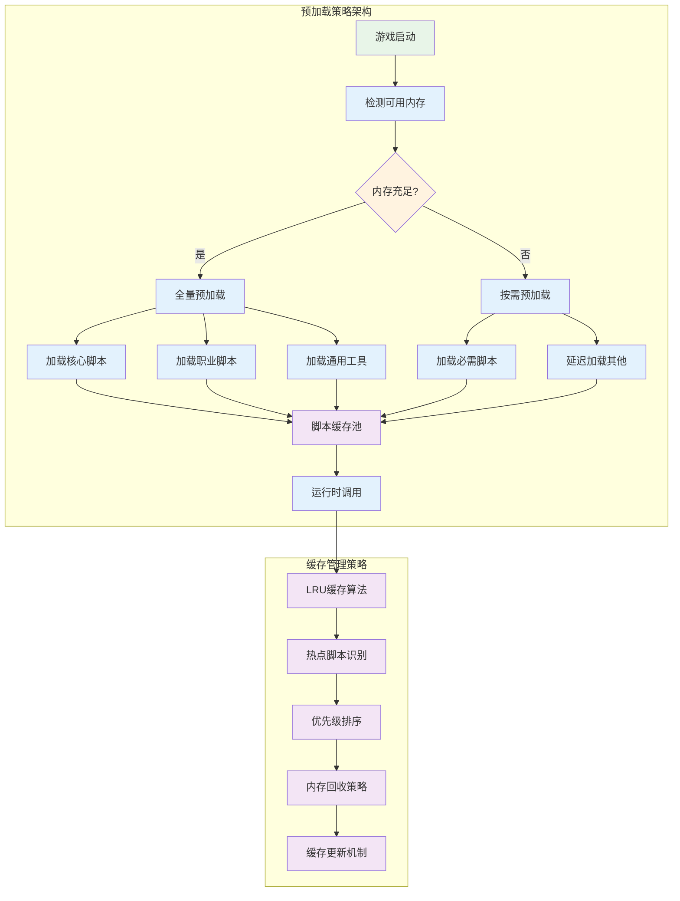

#### 1. 预加载策略
```squirrel
// 游戏启动时预加载常用脚本
function PreloadCommonScripts()
{
    // 预加载基础脚本
    sq_RunScript("sqr/common.nut");
    sq_RunScript("sqr/dnf_enum_header.nut");
    
    // 预加载当前角色相关脚本
    local characterJob = GetCurrentCharacterJob();
    switch(characterJob)
    {
        case ENUM_CHARACTERJOB_SWORDMAN:
            sq_RunScript("sqr/character/swordman/swordman_header.nut");
            sq_RunScript("sqr/character/swordman/swordman_common.nut");
            break;
        // ... 其他职业
    }
}
```

#### 2. 延迟加载策略
```squirrel
// 技能首次使用时才加载
function LazyLoadSkillScript(skillIndex)
{
    if (!IsSkillScriptLoaded(skillIndex)) {
        local scriptPath = GetSkillScriptPath(skillIndex);
        sq_RunScript(scriptPath);
        MarkSkillScriptLoaded(skillIndex);
    }
}
```

#### 3. 脚本缓存机制
```cpp
// 伪代码：脚本缓存管理
class ScriptCache
{
private:
    map<string, ScriptObject*> m_cache;
    int m_maxCacheSize;
    
public:
    ScriptObject* GetScript(const string& path)
    {
        auto it = m_cache.find(path);
        if (it != m_cache.end()) {
            return it->second;  // 缓存命中
        }
        
        // 缓存未命中，加载脚本
        ScriptObject* script = LoadScriptFromFile(path);
        
        // 检查缓存大小
        if (m_cache.size() >= m_maxCacheSize) {
            EvictLeastRecentlyUsed();
        }
        
        m_cache[path] = script;
        return script;
    }
};
```

### 函数调用优化

#### 1. 函数签名缓存
```cpp
// 伪代码：函数签名缓存
class FunctionSignatureCache
{
private:
    map<string, vector<string>> m_eventFunctionMap;
    
public:
    void BuildCache()
    {
        // 扫描所有已加载的脚本
        for (auto& script : g_loadedScripts) {
            auto functions = script->GetAllFunctions();
            for (auto& func : functions) {
                string eventType = ExtractEventType(func.name);
                if (!eventType.empty()) {
                    m_eventFunctionMap[eventType].push_back(func.name);
                }
            }
        }
    }
    
    vector<string> GetEventFunctions(const string& eventType)
    {
        auto it = m_eventFunctionMap.find(eventType);
        return (it != m_eventFunctionMap.end()) ? it->second : vector<string>();
    }
};
```

#### 2. 参数传递优化
```squirrel
// 避免频繁的参数拷贝
function OptimizedFunction(obj)
{
    // 缓存常用属性
    local objState = obj.sq_GetState();
    local objHP = obj.sq_GetHP();
    local objMP = obj.sq_GetMp();
    
    // 使用缓存的值进行计算
    if (objState == STATE_STAND && objHP > 100 && objMP > 50) {
        // 执行逻辑
    }
}
```

### 内存管理优化

#### 1. 对象池模式
```squirrel
// 对象池管理临时对象
class EffectObjectPool
{
    constructor()
    {
        this.pool = [];
        this.activeObjects = [];
    }
    
    function GetObject()
    {
        local obj;
        if (this.pool.len() > 0) {
            obj = this.pool.pop();  // 从池中获取
        } else {
            obj = CreateNewEffectObject();  // 创建新对象
        }
        
        this.activeObjects.append(obj);
        return obj;
    }
    
    function ReturnObject(obj)
    {
        // 重置对象状态
        obj.Reset();
        
        // 从活跃列表移除
        local index = this.activeObjects.find(obj);
        if (index != null) {
            this.activeObjects.remove(index);
        }
        
        // 返回到池中
        this.pool.append(obj);
    }
}
```

#### 2. 垃圾回收优化
```squirrel
// 手动触发垃圾回收
function OptimizeMemory()
{
    // 清理不需要的引用
    ClearTemporaryReferences();
    
    // 触发垃圾回收
    sq_collectgarbage();
    
    // 压缩内存
    sq_compactmemory();
}

// 在适当时机调用
function onLevelEnd()
{
    OptimizeMemory();
}
```

### 执行效率优化

#### 1. 条件判断优化
```squirrel
// 优化前：多次函数调用
function SlowFunction(obj)
{
    if (obj.sq_GetState() == STATE_STAND && 
        obj.sq_GetHP() > 100 && 
        obj.sq_GetMp() > 50 &&
        obj.sq_GetLevel() >= 20) {
        // 执行逻辑
    }
}

// 优化后：缓存结果，短路求值
function FastFunction(obj)
{
    local state = obj.sq_GetState();
    if (state != STATE_STAND) return;  // 快速退出
    
    local hp = obj.sq_GetHP();
    if (hp <= 100) return;
    
    local mp = obj.sq_GetMp();
    if (mp <= 50) return;
    
    local level = obj.sq_GetLevel();
    if (level < 20) return;
    
    // 执行逻辑
}
```

#### 2. 循环优化
```squirrel
// 优化前：每次循环都调用函数
function SlowLoop(obj)
{
    for (local i = 0; i < obj.sq_GetSkillCount(); i++) {
        local skill = obj.sq_GetSkill(i);
        // 处理技能
    }
}

// 优化后：缓存循环条件
function FastLoop(obj)
{
    local skillCount = obj.sq_GetSkillCount();
    for (local i = 0; i < skillCount; i++) {
        local skill = obj.sq_GetSkill(i);
        // 处理技能
    }
}
```

---

## 调试与排错

### 调试工具和方法

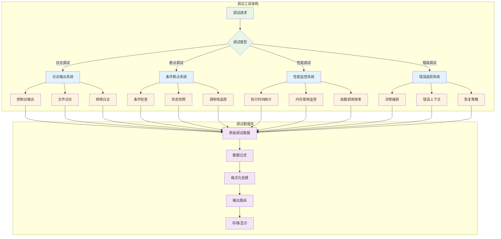

#### 1. 日志输出系统
```squirrel
// 自定义日志函数
function DebugLog(level, message)
{
    local timestamp = GetCurrentTime();
    local logMessage = "[" + timestamp + "] [" + level + "] " + message;
    
    // 输出到控制台
    print(logMessage);
    
    // 写入日志文件
    WriteToLogFile(logMessage);
}

// 使用示例
function onSetState_TestSkill(obj, state, datas, isResetTimer)
{
    DebugLog("INFO", "TestSkill state set, obj: " + obj + ", state: " + state);
    
    if (!obj) {
        DebugLog("ERROR", "TestSkill: obj is null!");
        return;
    }
    
    DebugLog("DEBUG", "TestSkill: Setting animation and attack info");
    obj.sq_SetCurrentAnimation(CUSTOM_ANI_01);
    obj.sq_SetCurrentAttackInfo(CUSTOM_ATK_01);
}
```

#### 2. 断点调试模拟
```squirrel
// 条件断点
function ConditionalBreakpoint(condition, message)
{
    if (condition) {
        DebugLog("BREAKPOINT", message);
        // 在这里可以输出更多调试信息
        PrintStackTrace();
        PrintVariableStates();
    }
}

// 使用示例
function proc_TestSkill(obj)
{
    local hp = obj.sq_GetHP();
    
    // 当HP低于100时触发断点
    ConditionalBreakpoint(hp < 100, "HP is critically low: " + hp);
    
    // 继续执行逻辑
}
```

#### 3. 性能监控
```squirrel
// 性能计时器
class PerformanceTimer
{
    constructor(name)
    {
        this.name = name;
        this.startTime = 0;
        this.endTime = 0;
    }
    
    function Start()
    {
        this.startTime = GetCurrentTimeMs();
    }
    
    function End()
    {
        this.endTime = GetCurrentTimeMs();
        local duration = this.endTime - this.startTime;
        DebugLog("PERF", this.name + " took " + duration + "ms");
    }
}

// 使用示例
function onSetState_ComplexSkill(obj, state, datas, isResetTimer)
{
    local timer = PerformanceTimer("ComplexSkill_onSetState");
    timer.Start();
    
    // 执行复杂逻辑
    PerformComplexCalculations(obj);
    
    timer.End();
}
```

### 常见错误类型和解决方案

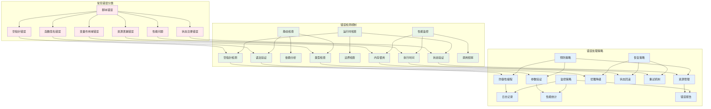

#### 1. 空指针错误
```squirrel
// 错误示例
function BadFunction(obj)
{
    obj.sq_SetCurrentAnimation(CUSTOM_ANI_01);  // 如果obj为null会崩溃
}

// 正确做法
function GoodFunction(obj)
{
    if (!obj) {
        DebugLog("ERROR", "GoodFunction: obj is null");
        return;
    }
    
    obj.sq_SetCurrentAnimation(CUSTOM_ANI_01);
}
```

#### 2. 函数名错误
```squirrel
// 错误：函数名不符合签名规范
function onSetState_wrongname(obj, state, datas, isResetTimer)  // 不会被调用
{
    // 逻辑代码
}

// 正确：函数名符合规范
function onSetState_CorrectName(obj, state, datas, isResetTimer)  // 会被正确调用
{
    // 逻辑代码
}
```

#### 3. 状态注册错误
```squirrel
// 错误：状态ID冲突
IRDSQRCharacter.pushState(ENUM_CHARACTERJOB_THIEF, "path1.nut", "skill1", 95, -1);
IRDSQRCharacter.pushState(ENUM_CHARACTERJOB_THIEF, "path2.nut", "skill2", 95, -1);  // 冲突！

// 正确：使用唯一的状态ID
IRDSQRCharacter.pushState(ENUM_CHARACTERJOB_THIEF, "path1.nut", "skill1", 95, -1);
IRDSQRCharacter.pushState(ENUM_CHARACTERJOB_THIEF, "path2.nut", "skill2", 96, -1);  // 正确
```

#### 4. 变量作用域错误
```squirrel
// 错误：变量作用域混乱
local globalVar = 100;

function Function1()
{
    globalVar = 200;  // 修改了全局变量
}

function Function2()
{
    local globalVar = 300;  // 创建了同名局部变量，可能引起混乱
    print(globalVar);  // 输出300，不是200
}

// 正确：明确变量作用域
g_globalVar <- 100;  // 明确的全局变量

function Function1()
{
    g_globalVar = 200;  // 明确修改全局变量
}

function Function2()
{
    local localVar = 300;  // 使用不同的变量名
    print(g_globalVar);    // 输出200
    print(localVar);       // 输出300
}
```

### 调试最佳实践

#### 1. 分层调试策略
```squirrel
// 第一层：基础功能验证
function DebugLevel1_BasicFunction(obj)
{
    DebugLog("DEBUG", "=== Level 1 Debug: Basic Function ===");
    DebugLog("DEBUG", "obj exists: " + (obj != null));
    
    if (obj) {
        DebugLog("DEBUG", "obj state: " + obj.sq_GetState());
        DebugLog("DEBUG", "obj HP: " + obj.sq_GetHP());
        DebugLog("DEBUG", "obj MP: " + obj.sq_GetMp());
    }
}

// 第二层：逻辑流程验证
function DebugLevel2_LogicFlow(obj, step)
{
    DebugLog("DEBUG", "=== Level 2 Debug: Logic Flow Step " + step + " ===");
    
    switch(step)
    {
        case 1:
            DebugLog("DEBUG", "Step 1: Initialization");
            break;
        case 2:
            DebugLog("DEBUG", "Step 2: Animation Setting");
            break;
        case 3:
            DebugLog("DEBUG", "Step 3: Attack Processing");
            break;
    }
}

// 第三层：性能和优化验证
function DebugLevel3_Performance(functionName, executionTime)
{
    DebugLog("DEBUG", "=== Level 3 Debug: Performance ===");
    DebugLog("DEBUG", "Function: " + functionName);
    DebugLog("DEBUG", "Execution Time: " + executionTime + "ms");
    
    if (executionTime > 16) {  // 超过一帧的时间
        DebugLog("WARNING", "Function " + functionName + " is too slow!");
    }
}
```

#### 2. 错误恢复机制
```squirrel
// 安全的函数调用包装器
function SafeCall(func, params, defaultReturn = null)
{
    try {
        return func.acall(this, params);
    } catch (e) {
        DebugLog("ERROR", "SafeCall failed: " + e);
        return defaultReturn;
    }
}

// 使用示例
function onSetState_SafeSkill(obj, state, datas, isResetTimer)
{
    // 安全地调用可能出错的函数
    local result = SafeCall(RiskyFunction, [obj, state], false);
    
    if (result) {
        // 成功执行
        ContinueNormalFlow(obj);
    } else {
        // 执行失败，使用备用方案
        ExecuteFallbackPlan(obj);
    }
}
```

---

## 最佳实践

### 代码组织和结构

#### 1. 文件组织规范
```
sqr/
├── loadstate.nut                    # 主入口文件
├── common.nut                       # 公共函数库
├── dnf_enum_header.nut             # 全局枚举定义
├── character/                       # 角色相关脚本
│   ├── common/                     # 角色公共脚本
│   │   ├── character_common.nut    # 角色通用函数
│   │   └── buff_system.nut         # BUFF系统
│   ├── thief/                      # 暗夜使者
│   │   ├── thief_header.nut        # 暗夜使者常量定义
│   │   ├── thief_load_state.nut    # 状态加载器
│   │   ├── thief_common.nut        # 暗夜使者公共函数
│   │   └── skills/                 # 技能脚本目录
│   │       ├── zskill00/           # 教学技能
│   │       │   └── zskill00.nut
│   │       └── shuriken/           # 手里剑
│   │           └── shuriken.nut
│   └── swordman/                   # 鬼剑士
│       ├── swordman_header.nut
│       ├── swordman_load_state.nut
│       └── skills/
└── utils/                          # 工具脚本
    ├── debug_utils.nut             # 调试工具
    ├── math_utils.nut              # 数学工具
    └── effect_utils.nut            # 特效工具
```

#### 2. 命名规范
```squirrel
// 常量命名：全大写，下划线分隔
STATE_SKILL_CAST <- 95;
SKILL_FIREBALL <- 220;
CUSTOM_ANI_ATTACK <- 0;

// 函数命名：驼峰式，动词开头
function calculateDamage(attack, defense) { }
function checkSkillCooldown(obj, skillIndex) { }
function applyBuffEffect(target, buffType) { }

// 变量命名：驼峰式，名词性
local playerLevel = obj.sq_GetLevel();
local skillDamage = calculateDamage(attack, defense);
local isSkillReady = checkSkillCooldown(obj, SKILL_FIREBALL);

// 类命名：帕斯卡式
class SkillManager { }
class EffectController { }
class BuffSystem { }
```

#### 3. 注释规范
```squirrel
/**
 * 计算技能伤害
 * @param {object} caster - 施法者对象
 * @param {object} target - 目标对象
 * @param {number} skillIndex - 技能索引
 * @param {number} skillLevel - 技能等级
 * @return {number} 最终伤害值
 */
function calculateSkillDamage(caster, target, skillIndex, skillLevel)
{
    if (!caster || !target) return 0;
    
    // 获取基础攻击力
    local baseAttack = caster.sq_GetPhysicalAttack();
    
    // 获取技能倍率
    local skillRate = GetSkillDamageRate(skillIndex, skillLevel);
    
    // 计算基础伤害
    local baseDamage = baseAttack * skillRate;
    
    // 应用防御减免
    local defense = target.sq_GetPhysicalDefense();
    local finalDamage = baseDamage * (1.0 - defense / (defense + 1000));
    
    return finalDamage.tointeger();
}
```

### 性能优化指南

#### 1. 避免频繁的对象创建
```squirrel
// 不好的做法：每次都创建新对象
function BadPractice(obj)
{
    for (local i = 0; i < 100; i++) {
        local tempData = {
            x = i,
            y = i * 2,
            z = i * 3
        };
        ProcessData(tempData);
    }
}

// 好的做法：重用对象
local g_tempData = { x = 0, y = 0, z = 0 };  // 全局重用对象

function GoodPractice(obj)
{
    for (local i = 0; i < 100; i++) {
        g_tempData.x = i;
        g_tempData.y = i * 2;
        g_tempData.z = i * 3;
        ProcessData(g_tempData);
    }
}
```

#### 2. 缓存计算结果
```squirrel
// 缓存系统
class CalculationCache
{
    constructor()
    {
        this.cache = {};
        this.maxSize = 1000;
    }
    
    function GetOrCalculate(key, calculationFunc)
    {
        if (key in this.cache) {
            return this.cache[key];  // 缓存命中
        }
        
        // 计算新值
        local result = calculationFunc();
        
        // 检查缓存大小
        if (this.cache.len() >= this.maxSize) {
            this.ClearOldEntries();
        }
        
        this.cache[key] <- result;
        return result;
    }
    
    function ClearOldEntries()
    {
        // 简单的清理策略：清空一半
        local keysToRemove = [];
        local count = 0;
        foreach (key, value in this.cache) {
            keysToRemove.append(key);
            count++;
            if (count >= this.maxSize / 2) break;
        }
        
        foreach (key in keysToRemove) {
            delete this.cache[key];
        }
    }
}

// 使用缓存
local g_damageCache = CalculationCache();

function GetCachedDamage(attackPower, skillLevel)
{
    local key = attackPower + "_" + skillLevel;
    return g_damageCache.GetOrCalculate(key, function() {
        return CalculateComplexDamage(attackPower, skillLevel);
    });
}
```

### 错误处理和容错

#### 1. 防御性编程
```squirrel
// 参数验证
function ValidateParameters(obj, skillIndex, targetPos)
{
    if (!obj) {
        DebugLog("ERROR", "ValidateParameters: obj is null");
        return false;
    }
    
    if (skillIndex < 0 || skillIndex >= MAX_SKILL_COUNT) {
        DebugLog("ERROR", "ValidateParameters: invalid skillIndex " + skillIndex);
        return false;
    }
    
    if (!targetPos || typeof(targetPos) != "table") {
        DebugLog("ERROR", "ValidateParameters: invalid targetPos");
        return false;
    }
    
    if (!("x" in targetPos) || !("y" in targetPos)) {
        DebugLog("ERROR", "ValidateParameters: targetPos missing coordinates");
        return false;
    }
    
    return true;
}

// 安全的技能释放函数
function SafeCastSkill(obj, skillIndex, targetPos)
{
    // 参数验证
    if (!ValidateParameters(obj, skillIndex, targetPos)) {
        return false;
    }
    
    // 状态检查
    local currentState = obj.sq_GetState();
    if (!IsValidCastState(currentState)) {
        DebugLog("WARNING", "Cannot cast skill in state " + currentState);
        return false;
    }
    
    // 资源检查
    local needMP = GetSkillMPCost(skillIndex);
    if (obj.sq_GetMp() < needMP) {
        DebugLog("WARNING", "Not enough MP to cast skill");
        return false;
    }
    
    // 执行技能
    try {
        return ExecuteSkill(obj, skillIndex, targetPos);
    } catch (e) {
        DebugLog("ERROR", "Skill execution failed: " + e);
        return false;
    }
}
```

#### 2. 优雅降级
```squirrel
// 特效系统的优雅降级
function PlayEffectWithFallback(effectPath, position, fallbackEffect = null)
{
    try {
        // 尝试播放主要特效
        local effect = CreateEffect(effectPath);
        if (effect) {
            effect.SetPosition(position);
            effect.Play();
            return true;
        }
    } catch (e) {
        DebugLog("WARNING", "Primary effect failed: " + e);
    }
    
    // 主要特效失败，尝试备用特效
    if (fallbackEffect) {
        try {
            local backupEffect = CreateEffect(fallbackEffect);
            if (backupEffect) {
                backupEffect.SetPosition(position);
                backupEffect.Play();
                return true;
            }
        } catch (e) {
            DebugLog("WARNING", "Fallback effect failed: " + e);
        }
    }
    
    // 所有特效都失败，使用最简单的视觉反馈
    CreateSimpleFlash(position);
    return false;
}
```

### 代码复用和模块化

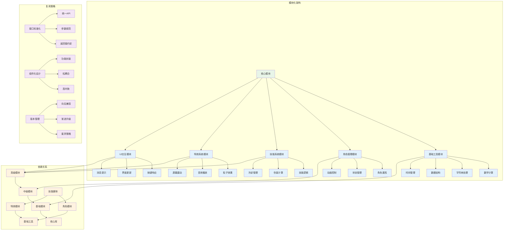

#### 1. 公共函数库
```squirrel
// character_common.nut - 角色公共函数
function GetCharacterDisplayName(obj)
{
    if (!obj) return "Unknown";
    
    local name = obj.sq_GetName();
    local level = obj.sq_GetLevel();
    return name + " (Lv." + level + ")";
}

function IsCharacterInCombat(obj)
{
    if (!obj) return false;
    
    local state = obj.sq_GetState();
    return (state >= STATE_ATTACK_START && state <= STATE_ATTACK_END) ||
           (state >= STATE_SKILL_START && state <= STATE_SKILL_END);
}

function GetCharacterDirection(obj)
{
    if (!obj) return DIRECTION_RIGHT;
    
    return obj.sq_GetDirection();
}

// 距离计算工具
function CalculateDistance2D(pos1, pos2)
{
    local dx = pos1.x - pos2.x;
    local dy = pos1.y - pos2.y;
    return sqrt(dx * dx + dy * dy);
}

function CalculateDistance3D(pos1, pos2)
{
    local dx = pos1.x - pos2.x;
    local dy = pos1.y - pos2.y;
    local dz = pos1.z - pos2.z;
    return sqrt(dx * dx + dy * dy + dz * dz);
}
```

#### 2. 技能基类系统
```squirrel
// skill_base.nut - 技能基类
class SkillBase
{
    constructor(skillIndex, stateIndex)
    {
        this.skillIndex = skillIndex;
        this.stateIndex = stateIndex;
        this.isActive = false;
        this.startTime = 0;
        this.duration = 0;
    }
    
    // 虚函数，子类需要重写
    function OnStart(obj, state, datas, isResetTimer) { }
    function OnUpdate(obj) { }
    function OnEnd(obj) { }
    function OnAttack(obj, damager, boundingBox, isStuck) { }
    
    // 公共方法
    function Start(obj, state, datas, isResetTimer)
    {
        this.isActive = true;
        this.startTime = GetCurrentTime();
        this.OnStart(obj, state, datas, isResetTimer);
    }
    
    function Update(obj)
    {
        if (!this.isActive) return;
        this.OnUpdate(obj);
    }
    
    function End(obj)
    {
        this.isActive = false;
        this.OnEnd(obj);
    }
}
```

---

## 总结

### DNF引擎Squirrel脚本调用机制全景图

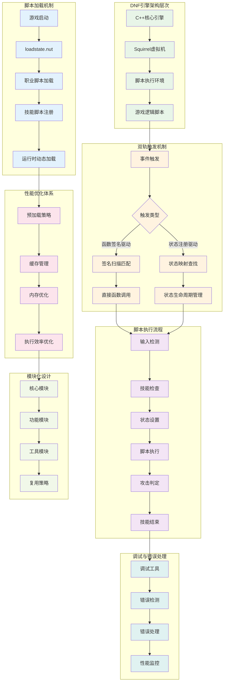

### 关键技术要点总结

1. **架构设计**：C++引擎 + Squirrel虚拟机的双层架构
2. **加载机制**：启动时预加载 + 运行时动态加载的混合策略
3. **触发机制**：函数签名驱动 + 状态注册驱动的双轨并行
4. **执行流程**：从输入检测到技能结束的完整生命周期管理
5. **性能优化**：多层次缓存 + 内存管理 + 执行效率优化
6. **调试支持**：完整的调试工具链和错误处理机制
7. **模块化**：高内聚低耦合的组件化设计

### 最佳实践建议

1. **遵循命名规范**：严格按照函数签名规范命名
2. **防御性编程**：充分的参数验证和错误处理
3. **性能意识**：合理使用缓存和避免不必要的计算
4. **模块化思维**：将复杂逻辑拆分为可复用的模块
5. **调试友好**：添加充分的日志和调试信息
6. **版本兼容**：考虑向后兼容性和渐进升级

通过深入理解这些机制和最佳实践，开发者可以更高效地开发DNF技能脚本，创造出更丰富的游戏体验。