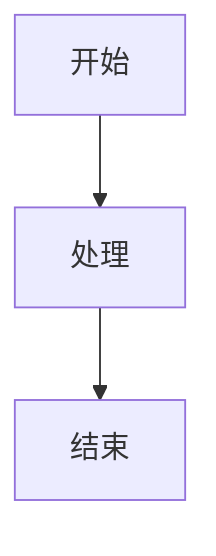
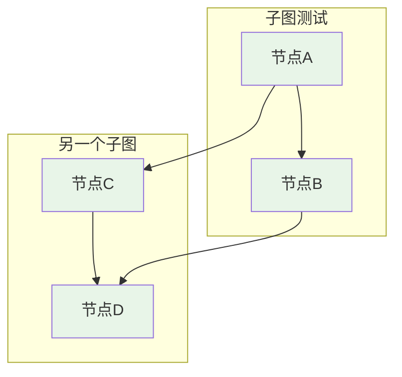
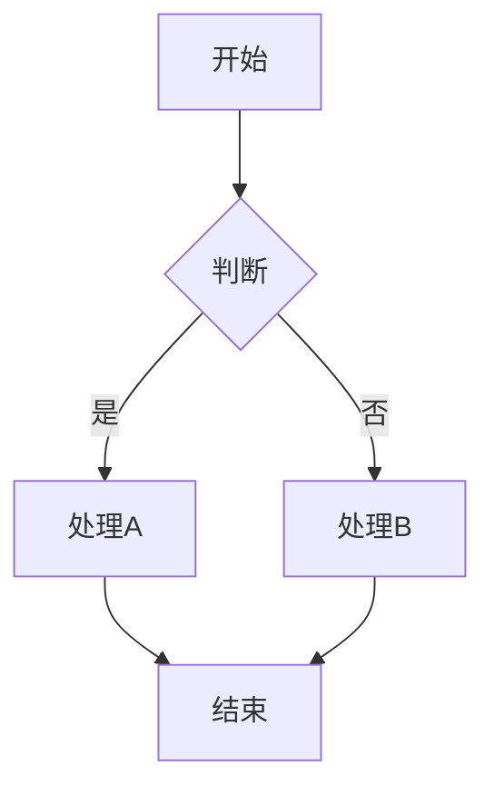

# Mermaid 语法测试

## 测试基本图表

```mermaid
graph TB
    A[开始] --> B[处理]
    B --> C[结束]
```

## 测试中文节点

```mermaid
graph LR
    A["中文节点"] --> B["另一个中文节点"]
    B --> C["结束节点"]
```

## 测试复杂图表

```mermaid
graph TB
    subgraph "子图测试"
        A[节点A] --> B[节点B]
    end
    
    subgraph "另一个子图"
        C[节点C] --> D[节点D]
    end
    
    A --> C
    B --> D
    
    classDef testClass fill:#e8f5e8
    class A,B,C,D testClass
```

## 测试流程图

```mermaid
flowchart TD
    A[开始] --> B{判断}
    B -->|是| C[处理A]
    B -->|否| D[处理B]
    C --> E[结束]
    D --> E
```